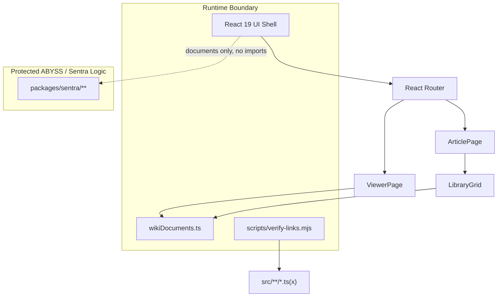

<div align="center">

# Sentra Wikirepo

**A navigable wiki surface for the ABYSS monorepo: architecture, governance,
clinical AI boundaries, and documentation discovery in one React app.**

_Built for Sentra Healthcare AI operators, contributors, and reviewers who need
to understand the system before they touch the system._

</div>

---

## Overview

<table>
<tr>
<td valign="middle" width="180">
  
</td>
<td valign="top">

**Sentra Wikirepo** is the documentation front door for the ABYSS engineering
surface. It turns monorepo architecture, app boundaries, crown-jewel access
rules, and operational governance into a fast internal wiki.

The app does not import Sentra clinical engines, own diagnosis logic, connect to
patient databases, or process PHI. It documents the boundary model and keeps
operators oriented before they work inside ABYSS.

</td>
</tr>
</table>

---

<div align="center">


**Architect:** Dr. Ferdi Iskandar · <drferdiiskandar@sentrahai.com>

**Target repo:** <https://github.com/drclassy/sentra-wikirepo>

</div>

---

## Executive Summary

- **Wiki-first app shell** - Wikipedia-inspired layout with top navigation,
  article tabs, infobox, table of contents, command center, and mobile drawer.
- **Route-safe document viewer** - Every generated wiki entry resolves to an
  internal `/viewer/:docId` route with a rendered article page.
- **Search surface** - The top search field routes to `/viewer/search?q=...`
  and renders indexed document results.
- **Boundary-aware content** - Runtime tier is `CJ-0 none`; the app documents
  crown-jewel rules without importing crown-jewel code.
- **Push-ready scaffold** - GitHub templates, CI workflow, README, security
  policy, contribution guide, changelog, local pnpm workspace, and verification
  scripts are included.

---

## Table of Contents

1. [Quickstart](#quickstart)
2. [Feature Map](#feature-map)
3. [Architecture](#architecture)
4. [Project Structure](#project-structure)
5. [Governance Boundary](#governance-boundary)
6. [Verification](#verification)
7. [GitHub Push Prep](#github-push-prep)
8. [Deployment](#deployment)
9. [Security](#security)
10. [License](#license)

---

## Quickstart

### Requirements

| Tool    | Version     | Purpose                  |
| ------- | ----------- | ------------------------ |
| Node.js | `>=22.12.0` | Vite and TypeScript      |
| pnpm    | `>=9.15.0`  | Package manager          |
| Git     | `>=2.x`     | Source control and push  |

Use `pnpm`. Do not use `npm` or `yarn`.

### Install

```bash
git clone https://github.com/drclassy/sentra-wikirepo.git
cd sentra-wikirepo
pnpm install
```

### Run Locally

```bash
pnpm dev
```

Open the local Vite URL, usually:

```text
http://localhost:3000
```

### Verify

```bash
pnpm verify
```

That command runs lint, typecheck, link verification, and production build.

---

## Feature Map

| Feature                    | Status | Notes                                                |
| -------------------------- | ------ | ---------------------------------------------------- |
| Article home page          | Live   | Long-form ABYSS monorepo article with infobox        |
| Document viewer            | Live   | Route-aware markdown rendering                       |
| Search route               | Live   | App-local indexed document registry                  |
| Mobile navigation          | Live   | Drawer with app navigation and contribution links    |
| Theme toggle               | Live   | Light/dark mode stored in local storage              |
| Link verifier              | Live   | Blocks placeholder links and unsafe public asset refs |
| Boundary manifest          | Live   | `app.boundary.json` documents CJ-0 runtime access     |
| Live repo ingestion        | Future | Requires an approved service boundary                |

---

## Architecture



### Design Choices

| Decision                | Choice                         | Reason                                      |
| ----------------------- | ------------------------------ | ------------------------------------------- |
| Framework               | React + Vite                   | Fast static app, simple GitHub deployment   |
| Routing                 | `react-router-dom`             | Client routes for wiki pages and search     |
| Content registry        | App-local TypeScript registry  | Deterministic routes without backend needs  |
| Styling                 | Tailwind CSS + custom tokens   | Small, readable, wiki-like interface        |
| Crown-jewel access      | `CJ-0 none`                    | Documentation surface only                  |
| Verification            | Lint + typecheck + link script | Catches broken static routes before deploy  |

---

## Project Structure

```text
sentra-wikirepo/
├── .github/
│   ├── ISSUE_TEMPLATE/
│   ├── workflows/ci.yml
│   ├── dependabot.yml
│   └── PULL_REQUEST_TEMPLATE.md
├── docs/
│   ├── ARCHITECTURE.md
│   ├── DEPLOYMENT.md
│   ├── GOVERNANCE.md
│   └── TESTING.md
├── public/
│   └── abyss-logo.png
├── scripts/
│   └── verify-links.mjs
├── src/
│   ├── components/
│   ├── data/wikiDocuments.ts
│   ├── hooks/
│   ├── lib/
│   ├── pages/
│   ├── App.tsx
│   ├── index.css
│   └── main.tsx
├── app.boundary.json
├── package.json
├── pnpm-workspace.yaml
├── tailwind.config.js
├── tsconfig*.json
└── vite.config.ts
```

---

## Governance Boundary

Sentra Wikirepo is an internal operator/documentation app.

| Field                   | Value                         |
| ----------------------- | ----------------------------- |
| Product classification  | `internal-operator-app`       |
| Standalone repo target  | `drclassy/sentra-wikirepo`    |
| Crown-jewel access tier | `CJ-0 none`                   |
| Access mode             | `none`                        |
| Owns crown-jewel logic  | `No`                          |
| Direct database access  | `No`                          |
| PHI handling            | `No PHI allowed`              |

Allowed:

- App-local React code
- Static documentation registry
- Public assets
- Links to documentation concepts

Forbidden:

- Imports from `packages/sentra/**/src/**`
- Crown-jewel internal imports
- Diagnosis, RAG, OCR, or document-intelligence algorithm copies
- Patient data, PHI, local runtime databases, or secrets

---

## Verification

Run the full local gate:

```bash
pnpm verify
```

Individual checks:

```bash
pnpm lint
pnpm typecheck
pnpm test
pnpm build
```

The app-local link verifier checks these rules:

- no `href="#"`
- no root-absolute public asset `src="/..."`
- no inert `preventDefault`-only click handlers

Recent browser QA checked:

| Check                     | Result |
| ------------------------- | ------ |
| Home page loads           | Pass   |
| Source route opens        | Pass   |
| Search route opens        | Pass   |
| Theme toggle works        | Pass   |
| Article tabs update state | Pass   |
| Mobile drawer opens       | Pass   |
| Placeholder links         | 0      |
| Unique viewer routes      | 132    |
| Broken viewer routes      | 0      |
| Console errors            | 0      |

---

## GitHub Push Prep

This folder is push-ready for:

```text
https://github.com/drclassy/sentra-wikirepo
```

From this directory:

```bash
git init
git branch -M main
git remote add origin https://github.com/drclassy/sentra-wikirepo.git
pnpm install
pnpm verify
git add .
git commit -m "feat: add Sentra Wikirepo"
git push -u origin main
```

If this app is exported from the ABYSS monorepo, copy only this directory's
contents. Do not copy ABYSS root `.agent/`, local `.env` files, monorepo
runtime databases, or ignored app artifacts.

---

## Deployment

Sentra Wikirepo builds to static files in `dist/`.

```bash
pnpm build
```

Recommended hosts:

| Host          | Notes                                  |
| ------------- | -------------------------------------- |
| Vercel        | Use Vite preset, output `dist`         |
| Netlify       | Build command `pnpm build`, dir `dist` |
| GitHub Pages  | Use a Pages workflow or static deploy  |
| Internal host | Serve `dist/` behind internal auth     |

For public deployment, review the content registry first. Wikirepo contains
architecture and governance language intended for controlled Sentra review.

---

## Security

Do not commit secrets, PHI, patient records, local databases, or proprietary
Sentra engine source.

Report security issues privately:

```text
drferdiiskandar@sentrahai.com
```

See [SECURITY.md](SECURITY.md).

---

## License

MIT. See [LICENSE](LICENSE).

Sentra clinical AI engines, crown-jewel packages, and proprietary healthcare
logic are not included in this repository and are not licensed by this app.

---

<div align="center">

**Version:** 0.1.0 · **Last updated:** 2026-06-02

Sentra Wikirepo - documentation you can navigate before code you can change.

</div>
