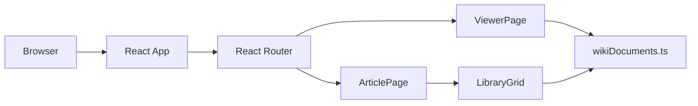

# Architecture

Sentra Wikirepo is a static React app with deterministic client-side routes.
It does not need a backend to render the current wiki surface.

## Runtime Flow

## Components

| Area             | Files                                 | Responsibility                         |
| ---------------- | ------------------------------------- | -------------------------------------- |
| App shell        | `src/App.tsx`, `src/main.tsx`         | Router and React bootstrap             |
| Article page     | `src/pages/ArticlePage.tsx`           | Main ABYSS overview article            |
| Viewer page      | `src/pages/ViewerPage.tsx`            | Render route-specific markdown content |
| Registry         | `src/data/wikiDocuments.ts`           | Slugs, search index, fallback entries  |
| Navigation       | `TopNav`, `Sidebar`, `MobileSidebar`  | Desktop and mobile navigation          |
| Wiki primitives  | `Infobox`, `TableOfContents`, `TabBar`| Article support components             |
| Verification     | `scripts/verify-links.mjs`            | Static link and asset checks           |

## Boundary

The app documents Sentra crown-jewel concepts without importing Sentra
implementation code. Keep it that way until the owner approves a service
boundary.
